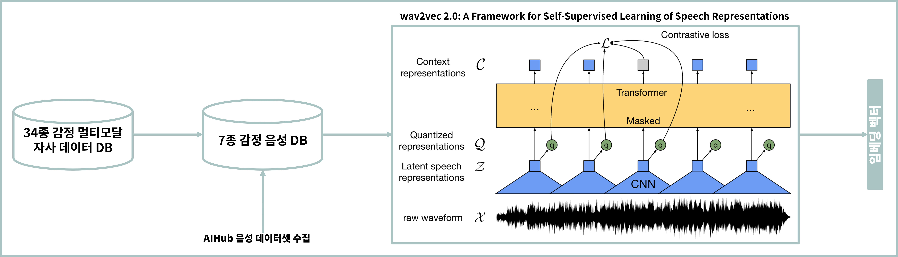

# Multimodal Emotion Classification (Speech · Text · Image)

> 음성·텍스트·이미지 기반 멀티모달 감정 분류 모델 개발 및 플랫폼 배포
> 기간: 2023.01 – 2023.06 | Repo: github.com/fly4hyun/multimodal-emotion

---

## Summary

* 자사 멀티모달 감정 분류 모델 성능 개선 및 **플랫폼 서비스 배포**
* **음성 데이터 추가 수집·전처리**, Wav2Vec2 기반 **음성 감정 모델** 개발
* **MFB(Multi-modal Factorized Bilinear Pooling)** 기반 **Late Fusion** 멀티모달 알고리즘 구현

---

## Dataset & Labeling

* 내부 34종 감정 멀티모달 데이터 + **AIHub 음성 감정 데이터 6종** 추가 수집 및 정제
* 34종을 7종으로 재구성하여 라벨 단순화

### 34종 → 7종 매핑 요약

* **34종 원라벨**: 분노, 억울함 / 싫음, 지루함, 미워함, 짜증남 / 두려움, 창피함, 불안, 당황 / 행복, 그리움, 기쁨, 사랑, 황홀함, 감동, 즐거움, 홀가분함, 설렘, 만족, 자신감, 고마움 / 슬픔, 미안함, 안타까움, 외로움, 실망, 괴로움, 부러움, 후회 / 놀람 / 중립, 바람, 무관심
* **7종 최종라벨**: **분노, 싫음, 두려움, 행복, 슬픔, 놀람, 중립**

---

## Modeling

### 음성 모델 (Unimodal)

* **Wav2Vec2.0** 파인튜닝으로 **음성 감정 분류** 모델 개발
* 한국어 발화 전처리(무음/클리핑/볼륨 정규화) 및 데이터 증강(시간 스트레치, 배경 노이즈) 적용

### 멀티모달 모델 (Late Fusion)

* 음성/텍스트/이미지 각각에서 **임베딩 벡터** 추출 → 공통 Feature Space에 저장
* **MFB** 기반 **Late Fusion**으로 모달 간 상호작용을 경량 결합
* 파이프라인: 추출(각 모달) → 정렬(타임·문장 기준) → 결합(MFB) → 분류(7-way)

---

## Serving & Platform

* **API** 설계/구현: 모델 추론(단일·배치), 신뢰도 점수, 예외 처리(무음/빈 텍스트)
* 자사 플랫폼에 배포하여 **실시간 감정 인식 기능** 제공

---

## Result

* 내부 벤치마크: 멀티모달 Late Fusion 적용 시 일관된 개선 경향(정량 수치 비공개)
* **DACON ‘음성 감정 인식 AI 경진대회’** 참가 기록: **0.81** (상대 점수), **923명 중 5등**

---

## My Contribution

* **음성 데이터 추가 수집·전처리** 파이프라인 구축
* **Wav2Vec2** 기반 **음성 감정 모델** 학습/튜닝
* **MFB Late Fusion** 멀티모달 알고리즘 구현 및 통합
* **API** 개발 및 **플랫폼 배포** 세팅

---

## Concept Image

  

## Notes on Disclosure

* 내부 데이터·지표 일부는 비공개이며, 구조/방법론/파이프라인 수준 설명만 제공합니다.
